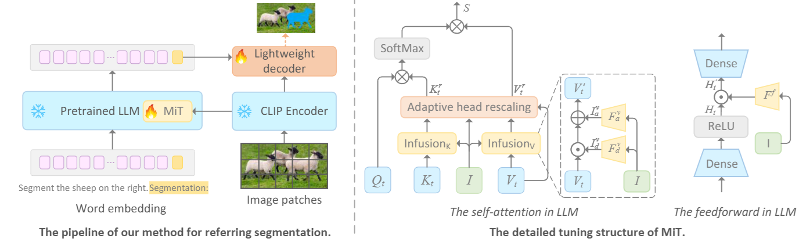
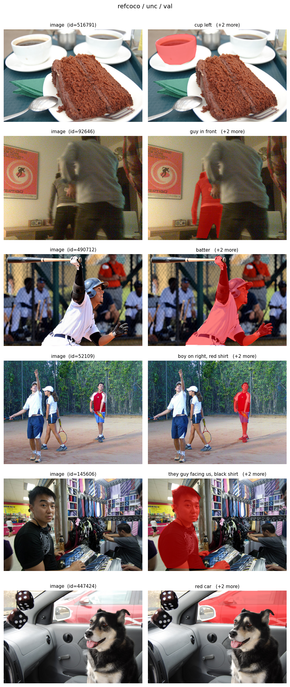

# Multimodal Infusion Tuning for Large Models (MiT)

Official implementation of **"Multimodal Infusion Tuning for Large Models" (MiT)**
— a parameter-efficient strategy that adapts a **frozen** large language model to
multimodal downstream tasks by *infusing* information from other modalities
(e.g. images) directly into the model's internal computation, rather than
prepending visual tokens.

This repository contains the **referring image segmentation** instantiation of MiT.

---

## 1. Method overview

<p align="center">
  
</p>
<p align="center"><i>Frozen LLaMA + frozen CLIP, only the lightweight MiT module and the segmentation decoder are trained (~2.5% of parameters).</i></p>

Instead of treating visual embeddings as extra tokens (which makes self-attention
cost grow quadratically), MiT **infuses** a global image representation
`I ∈ R^{d_I}` (from a frozen CLIP encoder) into selected LLaMA layers in a
**linear** manner. For each infused layer:

1. **K / V infusion (self-attention).** The image feature is mapped into the
   text space by a *multiply* transform (`I_d`) and an *add* transform (`I_a`),
   then fused element-wise into the textual key/value (paper Eq. 1–3):

   ```
   V'_t = V_t · I^v_d + I^v_a
   K'_t = K_t · I^k_d + I^k_a
   ```

2. **Adaptive head-wise rescaling.** To stabilize fusion across heads with
   heterogeneous statistics, a learnable per-head vector `L` is combined with the
   cosine similarity between the text value and the image feature, then gated by a
   sigmoid (paper Eq. 4–5):

   ```
   L' = L + cos_sim(V_t, I)
   V^r_t = V'_t · σ(L')      K^r_t = K'_t · σ(L')
   ```

3. **Feed-forward infusion.** The image feature also modulates the FFN block
   (paper Eq. 7):

   ```
   H'_t = H_t · F_f(I)
   ```

The **last-token** hidden state of the decoder-only LLM is taken as the infused
text representation and, together with multi-level CLIP feature maps, is fed to a
lightweight decoder to produce the segmentation mask (DICE / CE loss).

All foundation models (LLaMA, CLIP) are kept **frozen**; only the MiT transforms,
the learnable head vectors, and the decoder are trainable.

### Where this lives in the code

| Paper component | Code |
| --- | --- |
| K/V multiply / add transforms (`I_d`, `I_a`) | `fc_embedding_km/vm`, `fc_embedding_kp/vp` in [`Model.py`](Model.py) |
| Adaptive head-wise rescaling `σ(L + cos_sim)` | `custom_llama_attention_forward` in [`Model.py`](Model.py) |
| Feed-forward infusion `H_t · F_f(I)` | `custom_llama_mlp_forward` in [`Model.py`](Model.py) |
| Last-token pooling | `LLamaCustom.forward` in [`Model.py`](Model.py) |
| Lightweight decoder | [`DecoderTF.py`](DecoderTF.py) (default, CLIPSeg/FiLM style) and [`DecoderCNN.py`](DecoderCNN.py) (U-Net style) |

---

## 2. Repository layout

```
Model.py          # MiT model: frozen LLaMA with infused attention/FFN + CLIP + decoder
DecoderTF.py      # Transformer/FiLM lightweight segmentation decoder (default)
DecoderCNN.py     # CNN (U-Net style) segmentation decoder (alternative)
ReferDataset.py   # RefCOCO/RefCOCO+/RefCOCOg/RefCLEF dataset + dataloaders
refer.py          # REFER API (referring-expression annotations)
transforms.py     # image/mask transforms
Customization.py  # prompt template, backbone freezing, loss/forward helpers
Solver.py         # DDP training / evaluation loop, optimizer, metrics (oIoU, etc.)
Main.py           # entry point (launched with torchrun)
Parameters.py     # command-line arguments
Config.py         # local dataset / model-weight paths  <-- EDIT THIS
Utils.py          # logging, argparse helpers, IoU/DICE metrics
test_smoke.py     # weight-free logic smoke test (CPU)
check_data.py     # dataset sanity-check + sample visualization
requirements.txt
data/             # datasets live here (see Section 4)
images/           # figures and check_data.py visualizations
```

---

## 3. Environment

This codebase is built against **`transformers==4.35.x`** and will **not** run on
`transformers >= 4.36`. The model re-implements the LLaMA
attention/decoder/model forward passes of the 4.35 era and depends on:

* `transformers.modeling_attn_mask_utils._prepare_4d_causal_attention_mask`
* the `config._flash_attn_2_enabled` flag, and
* the legacy tuple-based KV cache

all of which changed in transformers 4.36 (switch to the `Cache` API).

```bash
conda create -n mit python=3.9
conda activate mit
# install a CUDA build of torch matching your machine, then:
pip install -r requirements.txt
```

> Note: `requirements.txt` pins `torch>=2.0`. For real training you need a CUDA
> build of PyTorch; the CPU build is only enough for `test_smoke.py`.

### Foundation models & data

Download and set the paths in [`Config.py`](Config.py):

* **LLaMA-2-7B** (HuggingFace format) → `ModelLLAMAPath`, `TokenizerPath`
* **CLIP** `clip-vit-large-patch14-336` (HuggingFace format) → `ModelCLIPPATH`
* **Referring-segmentation data** → `Data_path` (see **Section 4. Dataset preparation**)

---

## 4. Dataset preparation

This codebase uses the **referring image segmentation** datasets through the
standard [`refer`](https://github.com/lichengunc/refer) API
([`refer.py`](refer.py) + [`ReferDataset.py`](ReferDataset.py)).

> **📦 One-click data download.** We provide a single pre-packaged archive that
> contains everything below (COCO train2014 images, SAIAPR TC-12 images, and all
> `refs(*).p` / `instances.json` annotations) — just download, extract into
> `./data`, and you are ready to train. **Download: [MiT referring-segmentation data](DOWNLOAD_URL_HERE)**

### 4.1 Directory layout

Point `Data_path` in [`Config.py`](Config.py) to a root folder organized as
below. The COCO images are shared by RefCOCO / RefCOCO+ / RefCOCOg; RefCLEF uses
the SAIAPR TC-12 images.

```
<Data_path>/
├── COCOtrain2014/              # COCO train2014 images (≈82,791 *.jpg), shared by the three RefCOCO* sets
│   ├── COCO_train2014_000000000009.jpg
│   └── ...
├── refcoco/
│   ├── instances.json          # COCO-style annotations (images + segmentation polygons)
│   ├── refs(unc).p             # referring expressions, splitBy = unc
│   └── refs(google).p          # referring expressions, splitBy = google
├── refcoco+/
│   ├── instances.json
│   └── refs(unc).p
├── refcocog/
│   ├── instances.json
│   ├── refs(umd).p             # splitBy = umd
│   └── refs(google).p          # splitBy = google
├── refclef/
│   ├── instances.json
│   ├── refs(unc).p
│   └── refs(berkeley).p
└── saiapr_tc-12/               # SAIAPR TC-12 images for RefCLEF (folders 00..40, *.jpg)
    ├── 00/images/*.jpg
    └── ...
```

The actual layout bundled in this repository (`Data_path = ./data`) is:

```
data/
├── COCOtrain2014/                 # COCO train2014 images (*.jpg)
├── saiapr_tc-12/                  # SAIAPR TC-12 images for RefCLEF (folders 00..40)
├── refclef/
│   ├── instances.json
│   ├── refs(berkeley).p
│   └── refs(unc).p
├── refcoco/
│   ├── instances.json
│   ├── refs(google).p
│   └── refs(unc).p
├── refcoco+/
│   ├── instances.json
│   └── refs(unc).p
└── refcocog/
    ├── instances.json
    ├── refs(google).p
    └── refs(umd).p
```

For each `--dataset`/`--splitBy`, the loader reads **`refs(<splitBy>).p` + `instances.json`**
from `<Data_path>/<dataset>/`, and loads the corresponding image from
`<Data_path>/COCOtrain2014/` (or `<Data_path>/saiapr_tc-12/` for RefCLEF). The
ground-truth mask is decoded on the fly from the COCO polygons (`pycocotools`).

| `--dataset` | valid `--splitBy` | image folder |
| --- | --- | --- |
| `refcoco`  | `unc`, `google`   | `COCOtrain2014/` |
| `refcoco+` | `unc`             | `COCOtrain2014/` |
| `refcocog` | `umd`, `google`   | `COCOtrain2014/` |
| `refclef`  | `unc`, `berkeley` | `saiapr_tc-12/`  |

> A `Processed/` folder with per-split `*.pkl` files (if present) is **not used**
> by this code — the pipeline always reads the raw `refs(*).p` + `instances.json`.

### 4.2 Where to set the path

The dataset root is configured by `Data_path` in [`Config.py`](Config.py). It
**defaults to the in-repo `data/` folder**, so if your data already lives under
`./data` (the layout above) nothing needs to change. To use data stored
elsewhere, edit that one line:

```python
# Config.py — default (uses ./data):
Data_path = os.path.join(os.path.dirname(os.path.abspath(__file__)), 'data')
# ...or point to an absolute path:
Data_path = r'/path/to/your/ReferSeg'
```

### 4.3 Verify the data and visualize samples

[`check_data.py`](check_data.py) loads samples through the same REFER API,
reports an integrity summary, and writes a montage
(`image | ground-truth-mask overlay + referring expression`) to `images/`.

```bash
python check_data.py --data_root ./data --dataset all --num_samples 6
# add --dataset refcoco --splitBy unc --split testA for a single split
```

On the bundled data this produces, for example:

```
=== refcoco (splitBy=unc, split=val) ===
  refs: 3811 | images: 1500 | sentences: 10834 | avg sents/ref: 2.84
  checked 200 refs -> missing images: 0, empty masks: 0, mask/image shape mismatch: 0
  mask area ratio: mean 0.101, min 0.026, max 0.586
  saved visualization -> images/data_samples_refcoco_unc_val.png
```

| Dataset (val) | refs | images | sentences | integrity |
| --- | --- | --- | --- | --- |
| RefCOCO (unc)  | 3811 | 1500 | 10834 | 0 missing / 0 empty / 0 mismatch |
| RefCOCO+ (unc) | 3805 | 1500 | 10758 | 0 missing / 0 empty / 0 mismatch |
| RefCOCOg (umd) | 2573 | 1300 |  4896 | 0 missing / 0 empty / 0 mismatch |
| RefCLEF (unc)  | 9970 | 2000 | 12029 | 0 missing / 0 empty / 0 mismatch |

<p align="center">
  
</p>

---

## 5. Quick sanity check (no weights needed)

A weight-free smoke test builds tiny, random-initialized LLaMA/CLIP-shaped modules
and exercises the infusion math and both decoders on CPU:

```bash
python test_smoke.py
# [1/3] LLamaCustom infusion forward/backward ... OK   pooled (2, 128)
# [2/3] DecoderTF forward/backward ... OK   logits (2, 2, 144, 144)
# [3/3] DecoderCNN forward/backward ... OK   logits (2, 2, 128, 128)
# All smoke tests passed.
```

---

## 6. Training

Training uses PyTorch **DistributedDataParallel**. Set the GPU ids in
[`Config.py`](Config.py) (`CUDA = [0, 1]`) and launch with `torchrun`:

```bash
torchrun --nproc_per_node=2 Main.py \
    --task_name refcoco_mit \
    --dataset refcoco --splitBy unc \
    --input_size 336 --image_size 480 \
    --batch_size 8 --epochs_num 30 \
    --bfloat16 --vision_half --prompt_use \
    --integrate_layers 13-17-21-25-29-32 \
    --integrate_type B \
    --decoder_type TF --decoder_levels 18-12-6 \
    --loss CE --optm Adam --learning_rate 4e-5 \
    --lr_decrease step --lr_decrease_iter 10 --lr_decrease_rate 0.1
```

Key arguments (see [`Parameters.py`](Parameters.py) for the full list):

| Argument | Meaning |
| --- | --- |
| `--dataset` / `--splitBy` | `refcoco`/`refcoco+` (`unc`), `refcocog` (`umd`/`google`), `refclef` (`unc`) |
| `--integrate_layers` | LLaMA layers to infuse (paper: last ~1/3, e.g. `13-17-21-25-29-32`) |
| `--integrate_type` | infusion form; `B` is the method described in the paper |
| `--decoder_type` | `TF` (default, transformer/FiLM) or `CNN` (U-Net style) |
| `--decoder_levels` | CLIP hidden-state layers used by the decoder |
| `--bfloat16` / `--vision_half` | half-precision training |
| `--prompt_use` | wrap each expression with the segmentation prompt (Figure 3) |

Checkpoints, logs and TensorBoard events are written to `./Running/<task_name>/`.
Evaluation (overall IoU and precision@thresholds) runs automatically each epoch on
the validation/test splits.

---

## 7. Notes on this release

* This is the **referring segmentation** instantiation of MiT. The paper also
  reports image-text classification and multimodal sentiment analysis; those task
  heads are not included here.
* The model loads the LLaMA in eager attention (FlashAttention-2 is disabled on
  purpose, because the attention forward is overridden to perform the infusion).
* During development several model variants were explored; this release keeps the
  single, paper-faithful version (similarity-based adaptive head rescaling with
  separate multiply/add K/V transforms and FFN infusion).

---

## 8. Citation

```bibtex
@article{sun2024mit,
  title   = {Multimodal Infusion Tuning for Large Models},
  author  = {Sun, Hao and Song, Yu and Teng, Shiyu and Yu, Xinyao and Niu, Ziwei and Chen, Yen-Wei},
  journal = {ACM Transactions on Multimedia Computing, Communications, and Applications (TOMM)},
  year    = {2026}
}
```
